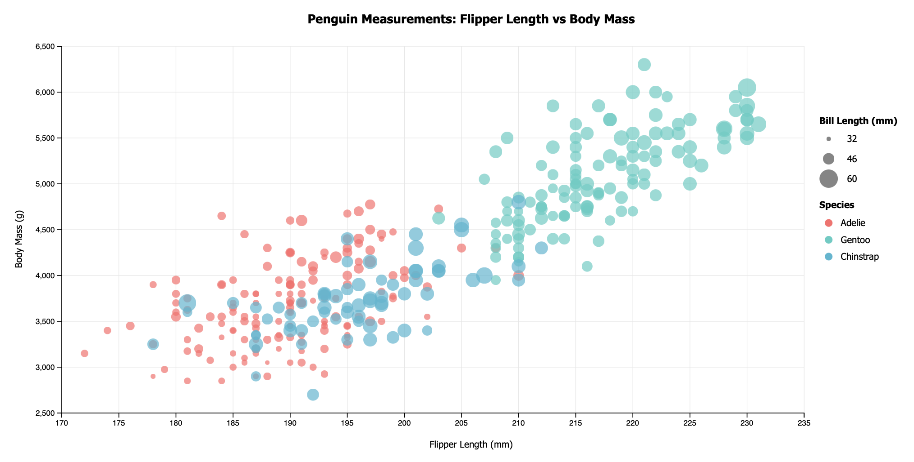

# 02-DataVis-5ways

Assignment 2 - Data Visualization, 5 Ways  
===

The goal of this project was to recreate the visualization below using **five difference visualization tools**, in order to compare how each tool handles visual encoding, interactivity, layout controll, and custimization. Each version uses the same sata but highlights the strengths and limitations of the chosen tool.

---

## d3.js

d3 is low-level JavaScript language for building fully custom visualizations and is best suited for situations where maximum control and flexibility are required.

As as computer science major, this tool felt the most natural to work with because everything had to be explicitly coded. While this required more effort and is not as easy as GUI tools, it allowed for precise control over the visualization.

- 

## R + ggplot2

R is

## Altair

Altair is 

## Flourish

Flourish is 

## DataWrapper

Data Wrapper is 

## Technical Achievements
- **Tooltips**: Using a combination of...
- **Legend**:
- **HTML Page References**:

### Design Achievements
- **idk**: idk