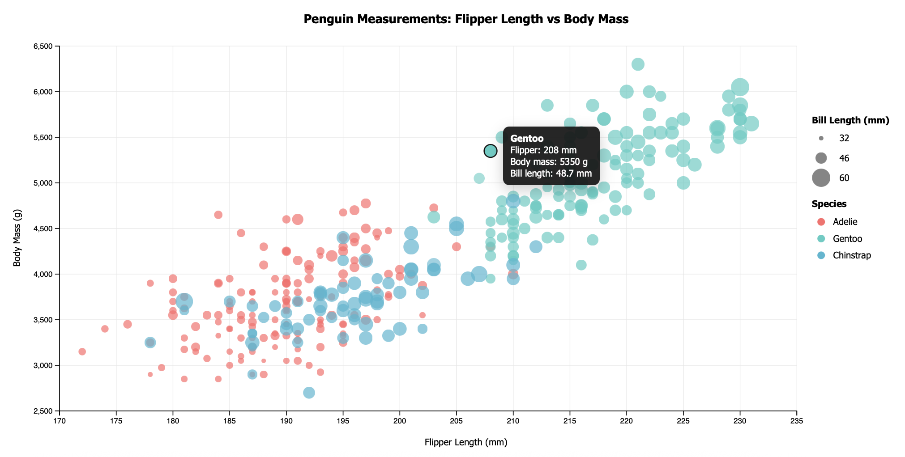
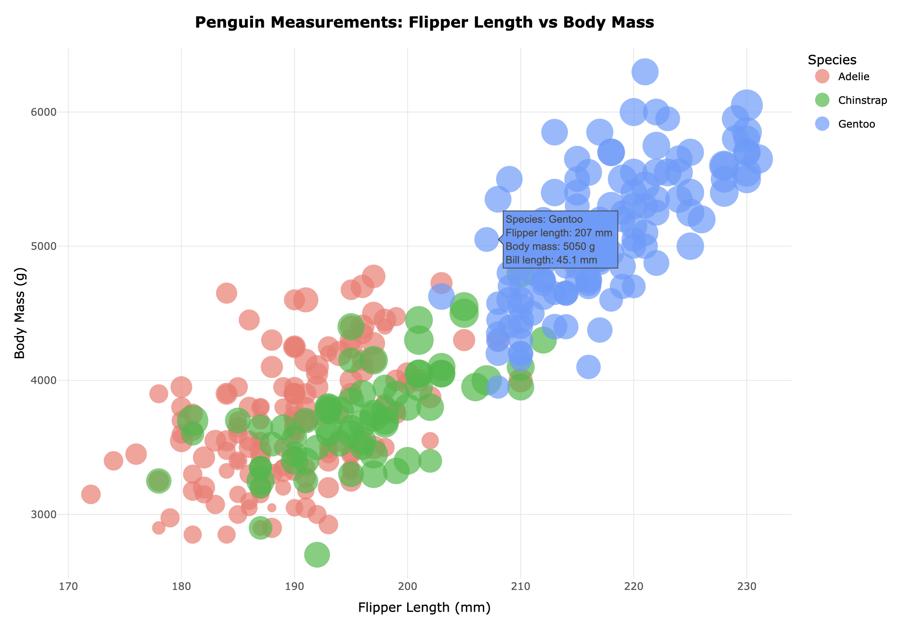
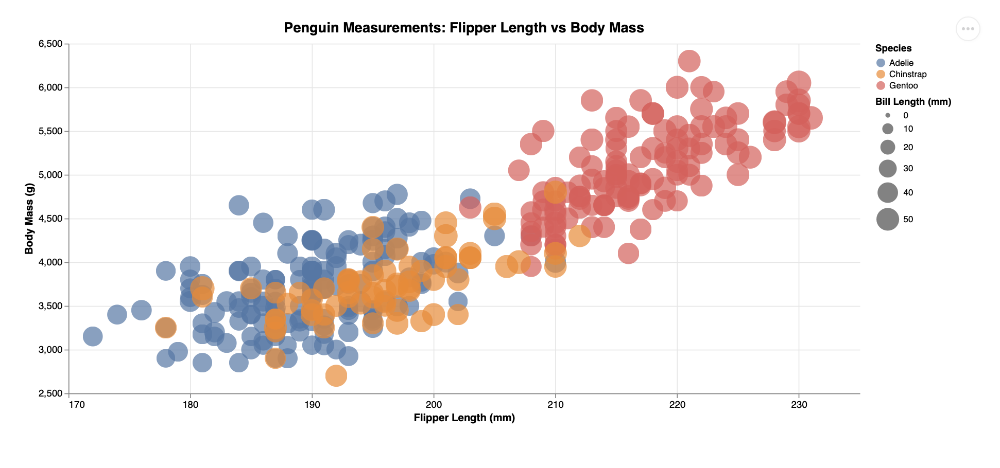
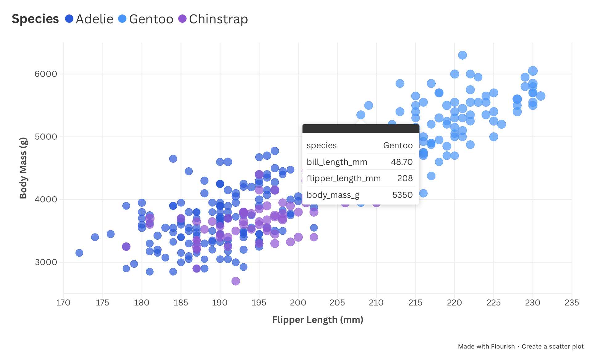
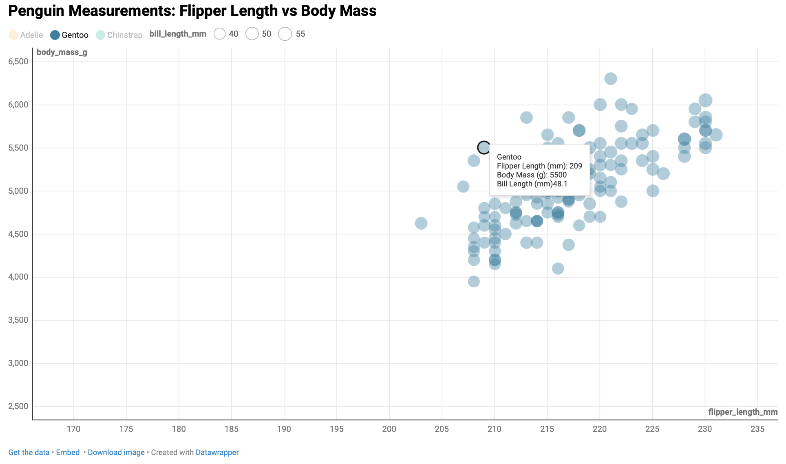

Assignment 2 - Data Visualization, 5 Ways  
===

The goal of this project was to recreate the visualization below using **five difference visualization tools**, in order to compare how each tool handles visual encoding, interactivity, layout control, and customization. Each version uses the same data but highlights the strengths and limitations of the chosen tool.

## Live Demo

View the live demo of this project available through GitHub Pages! [View Visualization Here!](https://diwakarsandhu1.github.io/a2-DataVis-5ways/)

---

## d3.js

d3 is low-level JavaScript language for building fully custom visualizations and is best suited for situations where maximum control and flexibility are required.

As a computer science major, this tool felt the most natural to work with because everything had to be explicitly coded. While this required more effort and is not as easy as GUI tools, it allowed for precise control over the visualization.

- Full control over circle size scaling
- Custom tooltips on hover
- Complete control over legend and layer behavior
- Closest match to reference visualization

## R + ggplot2

R is a statistical programming language, and ggplot2 is a high-level plotting library best suited for statistical analysis. I used R Markdown to generate an HTML output and embed the visualization into the site. ggplot2 makes it easy to create clean, well-strucutred plots, especially for static data analysis. However adding interactivity introduced the following challenges:
- Size legend did not translate cleanly when converting ggplot to plotly
- Plotly had limitations on legend customization
This approach worked well for statistical plotting, buy was difficult to replicate the reference image exactly.

## Altair

Altair is declarative visualization library built on Vega-lite and is best suited for quickly creating clear, high-level visualizations with minimal code. Altair made it easy to specify encodings such as color and position, but offered less control over fine-grained visual details.
- Circle sizes appeared visually smaller
- Limited customization of size scaling and legends

## Flourish

Flourish is a GUI-based data visualization platform designed for non-programmers and quick storytelling visuals. While it allows charts to be created quickly without code, customization is limited.
- Limited control over bubble size scaling
- Unable to display circle sizes in legend

## DataWrapper

Data Wrapper is a web-based visualization tool focused on accessibility and best suited for simple, clean data visualizations. Although easy to use, it offered the least flexibility for this assignment.
- Limited control over bubble size scaling
- Difficulty adjusting axis titles and layout

## Technical Achievements
- **Tooltips**: Implemented interactive tooltips for all visualizations
- **Legend**: Customized legends in tools that allowed it and identified limitations in others
- **HTML Page References**: Organized each visualization into a cohesive multi-page webpage
- **iFrames and Embeds**: Embedded external and generated visualizations
- **Select Certain Species**: Implemented ability to view visualizations based off Species; R/ggplot2 (through legend), Flourish (through legend), DataWrapper (through bubbles)

### Design Achievements
- **Responsiveness**: All visualizations adapt to different screen sizes
- **Webpage**: Provided different tabs and a navigation bar to view different visualizations
